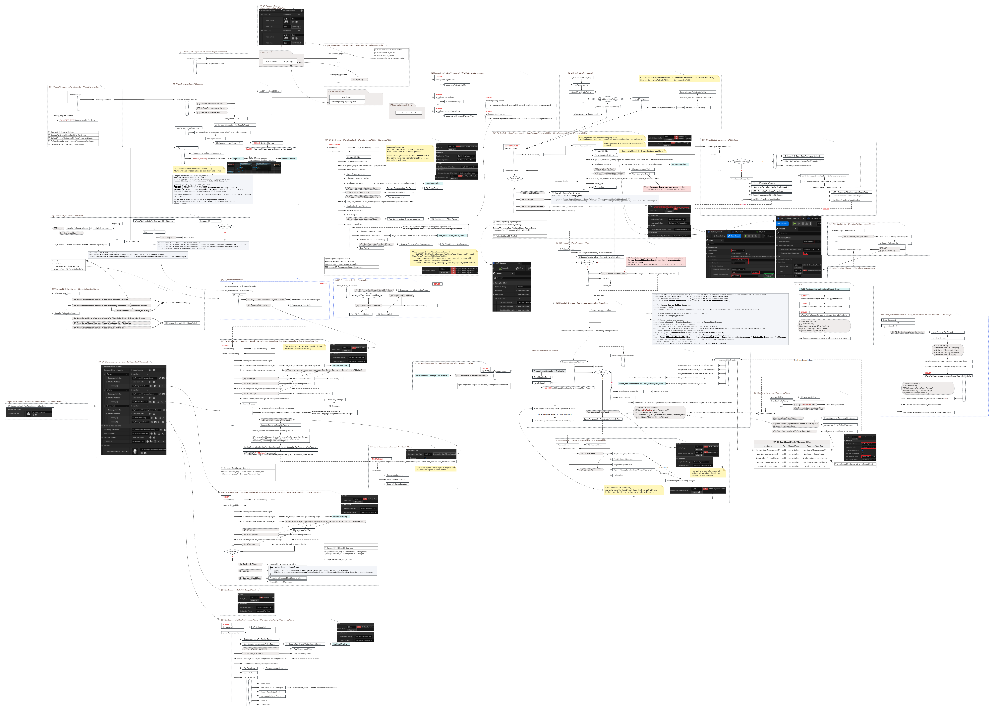
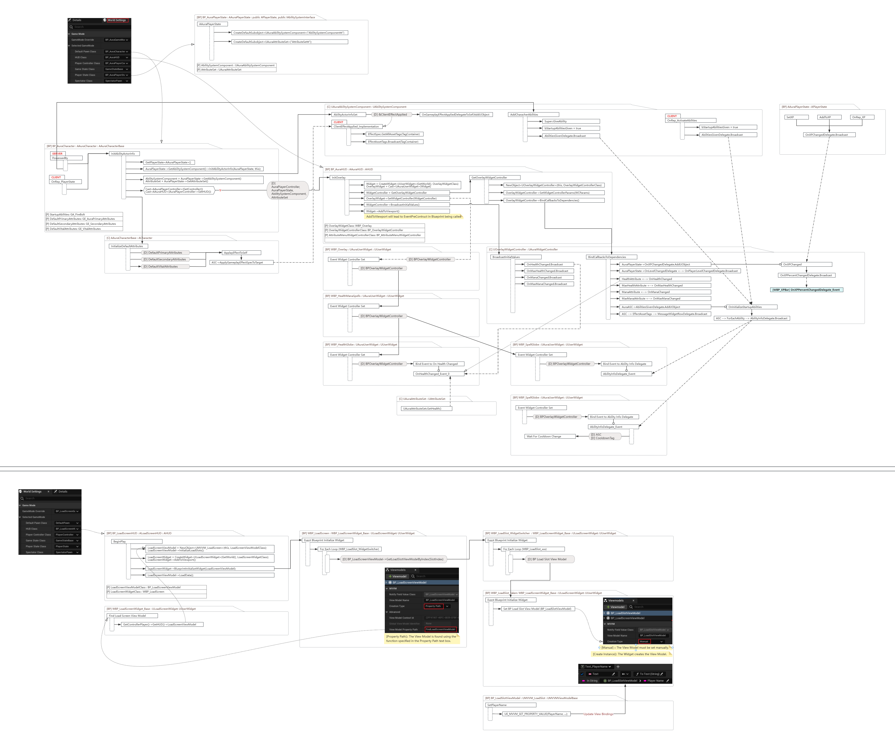

# 🎮 Unreal Engine 5.2 - GAS Top Down RPG

This project was built while completing the [Unreal Engine 5 - Gameplay Ability System - Top Down RPG](https://www.udemy.com/course/unreal-engine-5-gas-top-down-rpg/) course by **Stephen Ulibarri** on Udemy.  
It demonstrates a complete implementation of Unreal’s **Gameplay Ability System (GAS)** within a top-down RPG framework, developed using **C++**, **Blueprints**, and **UMG** in **Unreal Engine 5.2**.

## 📸 Screenshots


## 🚀 Project Overview

This project is a multiplayer-ready, modular action RPG system featuring ability-driven combat, gameplay effects, AI enemies, UI feedback, and reactive animation. It serves as a comprehensive showcase of GAS fundamentals and advanced usage, such as:

- Attribute Sets (Health, Mana, Strength, etc.)
- Gameplay Effects (Instant, Duration, Periodic)
- Abilities (Activated with cost, cooldown, and tags)
- Animation Montages and Hit Reactions
- Enemy AI with Behavior Trees
- Multiplayer replication of GAS systems
- UI feedback for Health, Mana, and Cooldowns

## 🔧 Features

### ⚔️ GAS Framework
- Fully integrated `UAbilitySystemComponent` and `UAttributeSet`
- Attribute-driven combat system (damage, healing, regen)
- Modular and reusable ability setup using Gameplay Tags and Data Assets
- Gameplay Effects with instant, periodic, and duration logic
- Cooldown & cost systems with tag-based restrictions

### 🧠 AI and Combat
- Enemy AI using behavior trees, blackboards, and perception
- Melee combat system with animation montages and root motion
- Hit reactions and damage application using gameplay cues

### 🧩 UI (UMG)
- Health and Mana bars using attribute bindings
- Floating combat text for damage and healing
- Cooldown indicators and ability hotbar setup
- UI updates via ASC delegates and tag events

### 🕹️ Player Control & Interaction
- Click-to-move top-down character controller
- Targeting system with mouse-over highlights and HUD updates
- Camera zoom and pan support

### 🌐 Multiplayer Ready
- Replication of GAS attributes, abilities, and effects
- Server-authoritative combat and prediction handling
- Multiplayer testable with UE5 PIE windows


## 💡 What I Learned

- Practical use of Unreal's Gameplay Ability System with UE 5.2
- Combining C++ and Blueprints for scalable architecture
- Creating responsive UI bound to gameplay attributes
- Structuring reusable, multiplayer-ready gameplay systems
- Building AI with BT and perception systems

### 🧭 Flowchart
- **The main gameplay framework**

- **The main UI framework**

- **Debugging**


## 🔨 Built With

- Unreal Engine **5.2**
- C++ & Blueprints Hybrid Architecture
- Gameplay Ability System (GAS)
- UMG (Unreal Motion Graphics)
- UE5 Networking Framework

## ▶️ Getting Started

1. Clone this repo:
   ```bash
   git clone https://github.com/FeifanXHome/GameplayAbilitySystem_Aura.git
   ```
2. Open the `.uproject` file in **Unreal Engine 5.2**
3. Compile the code in **Visual Studio 2022**
4. Press **Play** to test single-player
5. To test multiplayer: launch with 2+ players via New Editor Window (PIE)

## 📚 Course Source

Based on the Udemy course:  
[Unreal Engine 5 - Gameplay Ability System - Top Down RPG](https://www.udemy.com/course/unreal-engine-5-gas-top-down-rpg/)  
Instructor: [Stephen Ulibarri](https://www.udemy.com/user/stephen-ulibarri-3/)

**Stephen Ulibarri** is a top-rated Unreal Engine C++ instructor on Udemy with 70,000+ students. His course is recognized for its practical approach to gameplay programming and system architecture.

## 📜 License

This project is for educational and portfolio purposes only.  
All original course content belongs to the instructor.
